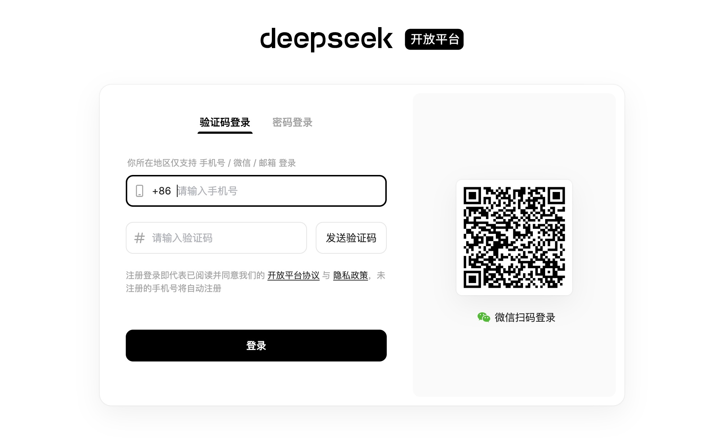
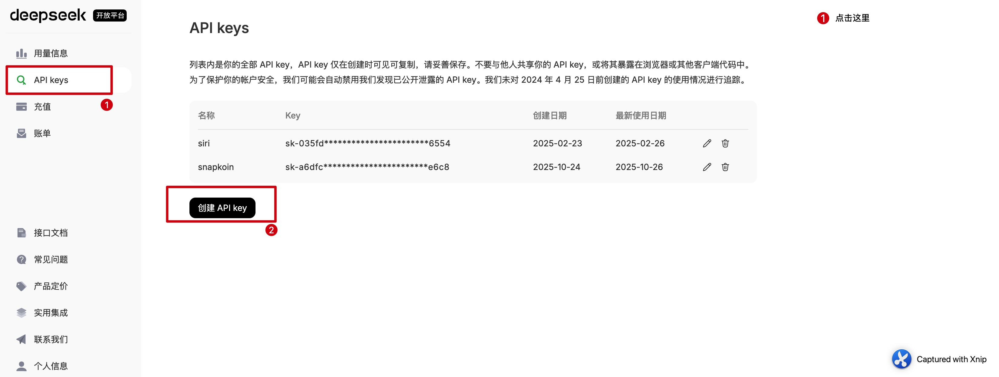
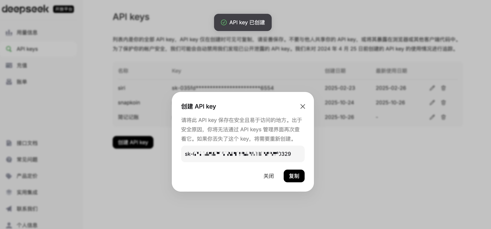
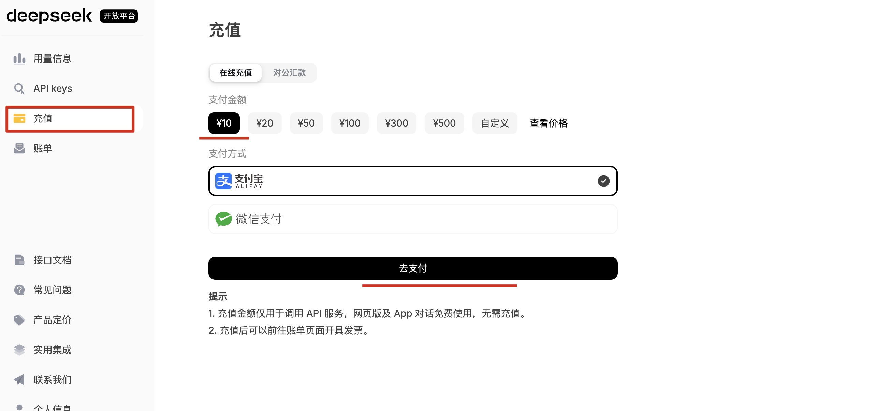
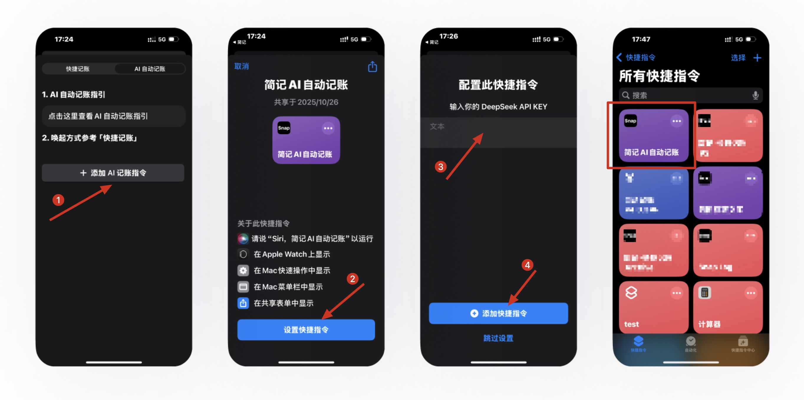
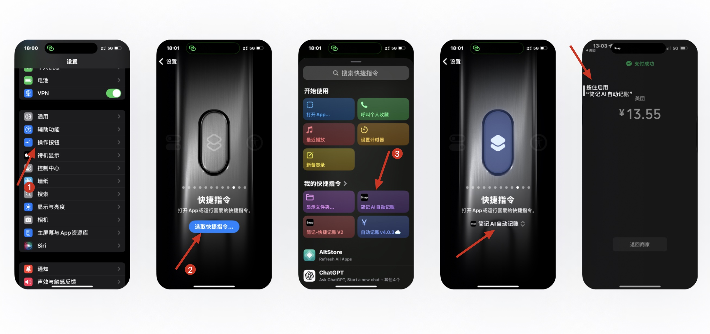

# 简记快捷记账 AI 记账配置指南

简记快捷记账 AI 记账借助的是 DeepSeek 的 API，DeepSeek 的 API 准确率高且价格实惠，非常适合用于 AI 记账。接下来介绍一下配置流程（如在配置过程中有任何疑问，请根据最下方提供的开发者联系方式与开发者沟通）。

## 配置流程

### 1. 访问 DeepSeek API 平台
首先打开 DeepSeek API 开放平台：[https://platform.deepseek.com](https://platform.deepseek.com)
扫码或手机号登陆

### 2. 创建 API Key
登陆进去后进入"API keys"，然后点击"创建 API key"

### 3. 设置并保存 API Key
输入 Key 名称，比如"简记自动记账"，创建后会生成一个"API key"，点击复制，并且保存下来（一定要复制保存，稍后会用到）

### 4. 账户充值
进行充值，选择充值 10 元即可（简单计算了一下假如每天记录 20 笔，大概可以用一年多），在用量信息那里可以看到费用消耗情况。
第一次充值需要实名认证，按照提示完成认证即可。

### 5. 配置快捷指令
充值完成后即可在 APP 里面一键添加配置快捷指令，前置操作：确保手机上安装了"快捷指令"这个 App

1. 进入 App 快捷记账-AI 自动记账，点击"添加 AI 记账指令"
2. 点击后会跳转到"快捷指令"这个 App，点击"设置快捷指令"
3. 将上面复制的"API key"粘贴到文本框，然后点击添加快捷指令

### 6. 配置唤起方式
完成以上"添加 AI 记账指令"操作后，可根据 App 里「快捷记账」提供的唤起方式配置一下唤起快捷指令的操作，以下通过“操作按钮”举例：

1. 进入手机「设置」-「操作按钮」
2. 右滑到「快捷指令」，点击"选取快捷指令"
3. 选择「简记 AI 自动记账」

在消费页面点击手机左侧「操作按钮」即可触发 「简记 AI 自动记账」

### 7. 获取帮助
如在配置过程中有任何问题，请联系开发者，注明来意

|         微信          |       小红书        |
|:-------------------:|:----------------:|
|  |  |

---

